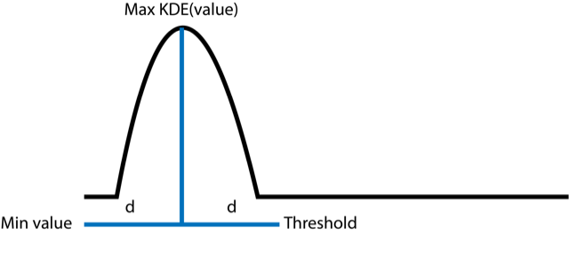
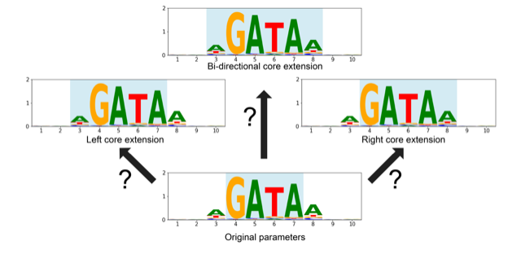

Optimization
============

CtrlF-TF uses multiple parameters when calling sites that one has
to select during the alignment step including:

1) Core definition
2) Number of gaps in the k-mer data
3) Threshold to use when calling binding sites

CtrlF-TF has 2 classes to optimize parameters and select thresholds by
benchmarking the performance of classification of sequences..

1) ClassifiedSequences
2) Optimize

ClassifiedSequences acts as a helper class, transforming an input dataframe
of values and sequences into a dataframe with the required columns for the
Opimize class. API details on these classes can be found in :ref:`Library_API`.

The ClassifiedSequences Class
-----------------------------

This class acts as a helper class for preparing input data to the
Optimize class. Specifically, it takes a dataframe (with or without
headers) in the form of:

===== =========
Value Sequence
===== =========
50000 CAATCG...
49554 ATCGAT...
...   ...
===== =========

It returns a dataframe with the following format:

===== ========= =====
Value Sequence  Group
===== ========= =====
50000 CAATCG... \+
49554 ATCGAT... \-
...   ...       ...
===== ========= =====

To use the class, initialize with the factory classmethod
`classify_from_dataframe`.

.. code:: python

   import pandas as pd
   import ctrlf_tf as cftf

   example_dataframe = pd.read_csv("file_location")
   result = cftf.ClassifiedSequences.from_dataframe(example_dataframe,
                                                  sequence_start = 1,
                                                  sequence_end = 36)

Specifying the sequence_start and sequence_end parameters internally
apply a slice operation to all DNA sequences. If using a PBM data
source, a typical sequence probe is 60bp long with the de Bruijn sequence
starting at the second base and ending at the 35th (1-based coordinates).
CtrlF-TF does not assume a particular subsection by default, and will
classify based on the entire sequence unless specified otherwise.

It is highly recommended to perform classification based on the same
subsection that the k-mer data is generated from.

By default, the classification uses a "kde_z4" method to label probes
as positive, negative, or ambiguous ('+', '-', '.'). This performs a
gaussian KDE using scipy.stats.gaussian_kde and selects the input value
from the distribution with the highest output in the KDE function. The
distance from the smallest value to this highest density value is added
to the highest density value to calculate one of the thresholds. The
result is to flip the left tail around the highest density value to capture
the distribution.

The other threshold is the modfied z-score based of medians of 4. The maximum
of the two is selected as the positive threshold and the minimum of the two
is the negative threshold.

However, one can also specify just using modified z-scores as thresholds. The
syntax for this would be:

.. code:: python

   cftf.ClassifiedSequences.from_dataframe(example_dataframe,
                                         sequence_start = 1,
                                         sequence_end = 36,
                                         method = "z-score",
                                         z_negative = 3,
                                         z_positive = 4)

The ClassifiedDeBuijn class contains several attributes for the
final result dataframe and the meta data on the input.

.. code:: python

   result = cftf.ClassifiedSequences.from_dataframe(example_dataframe)

   # Attributes
   result.dataframe # Pandas DataFrame output
   result.negative_threshold # Tuple of the definition and value
   result.positive_threshold # Tuple of the definition and value
   result.version # Verson of CtrlF-TF used

The method `save_to_file` saves the attribute information in text format.
Using `load_from_file` initializes a new instance with the information
from a previously saved ClassifiedSequences.

.. code:: python

   result.save_to_file("classified_debruijn_result.txt")
   new_object = cftf.load_from_file("classified_debruijn_result.txt")

Optimization of AlignParameters
-------------------------------

The Optimize class takes a set of AlignParameters and benchmarks their
performance against de bruijn sequences groups into "+" and "-"
categorgies.

Given an input of a classified debruijn dataframe and an initial set of
AlignParameters, for each set of:

1. 0 k-mer gaps
2. 0-1 k-mer gaps
3. 0-2 kmer gaps

Optimize will run Kompas against the classified sequences.
It will then generate a partial AUROC up to a given threshold (default =
0.01 false positive rate) as an initial performance metric. If the
alignment model is non-palindromic (palindrome == False), then the
model will be extended left, right, and in both directions. Each of these
are compared and the max partial AUROC is chosen as the best parameter
set.

If the best parameter is an extended parameter, the process repeats until
the initial parameter is not improved upon via extension. The top partial
AUROCs for each kmer gap set are compared to chose the k-mer gap
parameter.

For a model assumed to be palindromic (palindrome == True), then the model
is only extended in both directions during optimization.

Suppose one had classified a dataset previously. The syntax for running the
Optimizer would be:

.. code:: python

   import ctrlf_tf as cftf

   classified = ClassifiedSequences.load_from_file("classified_result.txt")

   params = cftf.AlignParameters(kmer_file = "example_kmer_file.txt",
                                pwm_file = "GATA_example_pwm.txt",
                                core_tart = 4,
                                core_end = 7)

   optimized_params = Optimize(params,
                               classified.dataframe)

After initialization, the Opimizer contains multiple attributes detailing
the results. To access which parameters were tested, their performance,
and the top results:

.. code:: python

   # AlignParameters of the top results
   optimized_params.optimal_parameters

   # DataFrame of all parameters examined up to the top choice
   optimized_params.parameter_dataframe

The parameter dataframe contains the followng information (example):

== ============== ====== =============== ========== ======== =========
ID Kmer_Gap_Limit pAUROC Score_Threshold Core_Start Core_End Core_Gaps
== ============== ====== =============== ========== ======== =========
0  0              0.004  0.42            4          7        None
1  0              0.005  0.44            3          7        None
2  1              0.005  0.41            4          7        None
3  2              0.006  0.46            4          7        None
== ============== ====== =============== ========== ======== =========

The pAUROC reported will be the partial AUROC. For example, given a FPR
threshold of 0.01 (default value), the max reported value would be 0.01.

The ID values of the parameter dataframe can be used to retrieve the
TPR and FPR dataframe used to generate the pAUROC values. This can be
done using the `.tpr_fpr_dictionary` attribute where each key is an
ID from the dataframe.

.. code:: python

   # Access the TPR FPR dataframe for ID = 0
   optimized_params.tpr_fpr_dictionary[0]

.. note::

   All of the figures and example tables are examples and not from real
   datasets.
